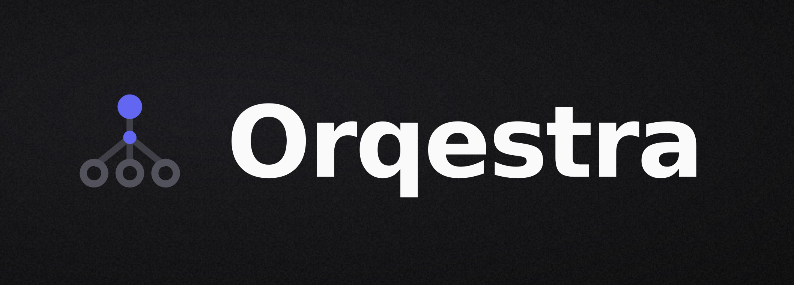

<p align="center">
  
</p>

# Orqestra

Self-hosted AI orchestration platform. Turns one box — or many — into your own AI cloud: notebooks, model hosting, Linux sandboxes, and multi-agent swarms. No rented GPUs, no vendor lock-in.

- Spin up isolated **Jupyter containers** (Base / TensorFlow / PyTorch / R) with persistent volumes, GPU passthrough, served at `https://<slug>.<domain>` with token auth.
- Host **LLMs** through Ollama or Docker Model Runner — search the live catalog, pick a model + tag, container exposes an OpenAI-compatible API at `/v1/chat/completions`.
- **SSH Sandboxes** — disposable Linux containers (Ubuntu 22.04 / 24.04, Debian 12, Alpine) with a generated keypair, CPU/RAM/GPU limits, and a persistent work volume. Host a custom inference server or just experiment.
- **AgentHive** — build multi-agent swarms: define specialist agents, wire them with explicit communication flows (`send_message` to delegate-and-collect, `handoff` to transfer control), and watch them collaborate in real time. Agents run on OpenAI, any major provider via LiteLLM (Anthropic, Gemini, Groq, Mistral, DeepSeek, …), or your own Orqestra-hosted local models.
- Live **container logs**, **agent conversation streams**, and **resource stats** pushed to the dashboard over WebSockets.
- **File explorer** to browse + download files inside any Jupyter container.
- Full **TLS** via Traefik + Let's Encrypt + Cloudflare DNS-01.
- Multi-tenant with auth (Better Auth), tags, multi-select bulk delete.

---

## Install

One command — Linux or macOS, x64 or arm64:

```bash
curl -fsSL https://orqestra.xyz/install | bash
```

Picks per-arch binary, runs interactive installer.

Two install modes:

| Mode | Use when | What you get |
|------|----------|--------------|
| **local** | Laptop / dev box | Plain HTTP, ports on localhost, no domain |
| **server** | Public host | HTTPS via Traefik, wildcard DNS, full feature set |

Full walkthrough: **[docs/INSTALL.md](docs/INSTALL.md)**.

---

## Features

### Jupyter on demand
Isolated notebook containers with a runtime of your choice, per-container CPU/RAM/GPU caps, a persistent volume, and an in-app file browser for downloads.

### Model hosting
Pull any model from a unified catalog (Ollama + Docker Model Runner). Each model project exposes an OpenAI-compatible `/v1` endpoint. GPU index pinning, advisory VRAM allocation, background pulls with live readiness polling.

### SSH Sandboxes
Bare Linux containers you SSH into as root. Orqestra generates an ed25519 keypair at create time — the private key is shown once for download, never persisted. CPU/RAM/GPU limits and a `/root/work` persistent volume. localhost-only port binding in v0.

### AgentHive
Multi-agent orchestration built on the OpenAI Agents SDK.

- **Custom agents** — name, role, full markdown instructions, per-agent LLM backend.
- **Three backends per agent** — OpenAI cloud, any LiteLLM provider (Anthropic, Gemini, Groq, Mistral, DeepSeek, OpenRouter, Together, xAI, Fireworks, Cohere), or an Orqestra-hosted local model.
- **Explicit communication flows** — directional edges between agents, each `send_message` (delegate, collect, synthesize) or `handoff` (transfer control). No implicit wiring; an agent can only reach agents it has a flow to.
- **Orchestration patterns** — Handoff (sequential, tight feedback) and Orchestrator–Worker (parallel, high autonomy); the entry agent decides per turn.
- **Per-swarm Python harness** — each swarm runs in its own container; the orchestrator builds the harness image once and reuses it.
- **Realtime** — agent messages, tool calls, handoffs, and the final answer stream live to the chat UI; full execution trace + persisted thread history in Postgres.
- **Editable** — change a swarm's agents, flows, or instructions any time; the container is recreated, threads and history preserved.
- Output is rendered as markdown + LaTeX + syntax-highlighted code in the chat.

### Realtime everywhere
Redis pub/sub fans container logs, build progress, and agent runs out to the browser over a single WebSocket service.

---

## Stack

| Layer | Tech |
|-------|------|
| Web | Next.js 15 (App Router), Tailwind v4, shadcn-style, react-markdown + KaTeX |
| API | Bun + Hono + tRPC v11 + Better Auth + BullMQ |
| WebSocket | Bun native WS — fans Redis pubsub to browser |
| Orchestrators | Go + Gin + Docker SDK — one each for Jupyter, hosting/models, sandboxes, AgentHive |
| Agent runtime | Python harness (FastAPI) wrapping the OpenAI Agents SDK + LiteLLM |
| Reverse proxy | Traefik v3 + Let's Encrypt (DNS-01 via Cloudflare) |
| Data | PostgreSQL 17 + Drizzle ORM, Redis 7 |
| Catalog | Live `docker model search` + Hub API + Ollama scrape |

---

## Architecture

```
                 browser
                    │
                    ▼
   ┌──────── Traefik (server mode) ────────┐
   │  *.{domain} → routes by Host header   │
   └─┬───────────────┬───────┬─────────────┘
     │               │       │
     ▼               ▼       ▼
   web (3000)    api (4000)  ws (4001)
                     │              │
                     │  ┌───────────┘
                     ▼  ▼
                  Postgres + Redis
                     │
                     ├─→ orchestrator-jupyter   (8080) ─→ Docker socket
                     │      └─ jupyter/* containers, volumes, file browser
                     │
                     ├─→ orchestrator-hosting   (8081) ─→ Docker socket
                     │      ├─ ollama/ollama containers per model
                     │      ├─ Docker Model Runner via /v1/...
                     │      └─ scrapes Hub + Ollama for live catalog
                     │
                     ├─→ orchestrator-sandbox   (8082) ─→ Docker socket
                     │      └─ Linux containers + generated SSH keys
                     │
                     └─→ orchestrator-agenthive (8083) ─→ Docker socket
                            ├─ builds the Python harness image
                            ├─ one harness container per swarm
                            └─ proxies /run, streams agent events to Redis
```

Container logs, build progress, and agent runs all stream the same way:
```
container stdout/stderr  (or harness agent events)
  → orchestrator's logtail goroutine
  → Redis PUBLISH container-logs:<projectId|runId>
  → ws server PSUBSCRIBE container-logs:*
  → browser WebSocket
```

The AgentHive harness also calls back into the API (`/internal/agenthive/thread-append`, `X-Internal-Secret`) to persist every agent message to Postgres.

---

## Repo layout

```
apps/
  api/                    Bun + Hono + tRPC + BullMQ workers
  ws/                     Bun WebSocket fan-out
  orchestrator-jupyter/   Go + Gin — Jupyter container manager
  orchestrator-hosting/   Go + Gin — LLM hosting + catalog
  orchestrator-sandbox/   Go + Gin — SSH Linux sandboxes
  orchestrator-agenthive/ Go + Gin — multi-agent swarms; embeds the Python harness
  web/                    Next.js 15 dashboard
packages/
  db/                     Drizzle schema + client
  trpc/                   Shared routers + types
  env/                    t3-env validated env schemas
  models/                 Catalog refresh logic
docker/
  traefik/                Traefik config + acme.json
  jupyter-images/         Optional custom Jupyter images
scripts/
  install.sh              Full bash installer (no binaries; runs every step)
docs/                     Documentation
docker-compose.yml
turbo.json
pnpm-workspace.yaml
```

---

## Documentation

- **[docs/INSTALL.md](docs/INSTALL.md)** — End-user install walkthrough
- **[docs/DEVELOPMENT.md](docs/DEVELOPMENT.md)** — Clone the repo, run from source, contribute
- **[docs/RELEASING.md](docs/RELEASING.md)** — Maintainer: build binaries, tag, publish releases
- **[RUN_COMMANDS.md](RUN_COMMANDS.md)** — Quick reference for all dev commands
- **[BUILDER.md](BUILDER.md)** — Original spec (kept for reference)

---

## Status

v1.0.0 — single-server, single-org. Mature local-dev path; server install tested with Cloudflare DNS-01. SaaS multi-tenant is not yet supported (one user pool per install).

---

## Roadmap / future features

Tracking what's planned but not built. Order is rough priority, not a commitment.

- [ ] **AgentHive workflows** — DAG execution across a swarm: dependency ordering, parallel branches, conditional routing, human-approval checkpoints, checkpoint/resume.
- [ ] **Artifact generation** — agents that asynchronously produce files (pptx / pdf / docx / xlsx / md / csv …) into a centralized, downloadable workspace.
- [ ] **Markdown instruction editor** — split-pane editor with live preview, templates, and version history for agent instructions.
- [ ] **Sandbox production routing** — public SSH access beyond localhost (bastion / TCP entrypoint).
- [ ] **Static-site hosting** — clone repo, build, serve at `<slug>.<domain>`.
- [ ] **SaaS multi-tenant** — orgs, per-org quotas, billing hooks.
- [ ] **GPU scheduler** — fair-share across users + project priorities, instead of first-come.
- [ ] **Backups** — postgres + named-volume snapshot/restore CLI.
- [ ] **Audit log** — who started/stopped which container, exposed in dashboard.
- [ ] **Per-project secrets vault** — bound to container env at create time, encrypted at rest.

PRs and issue threads welcome — file under the relevant feature label.

---

## License

See [LICENSE](LICENSE).
