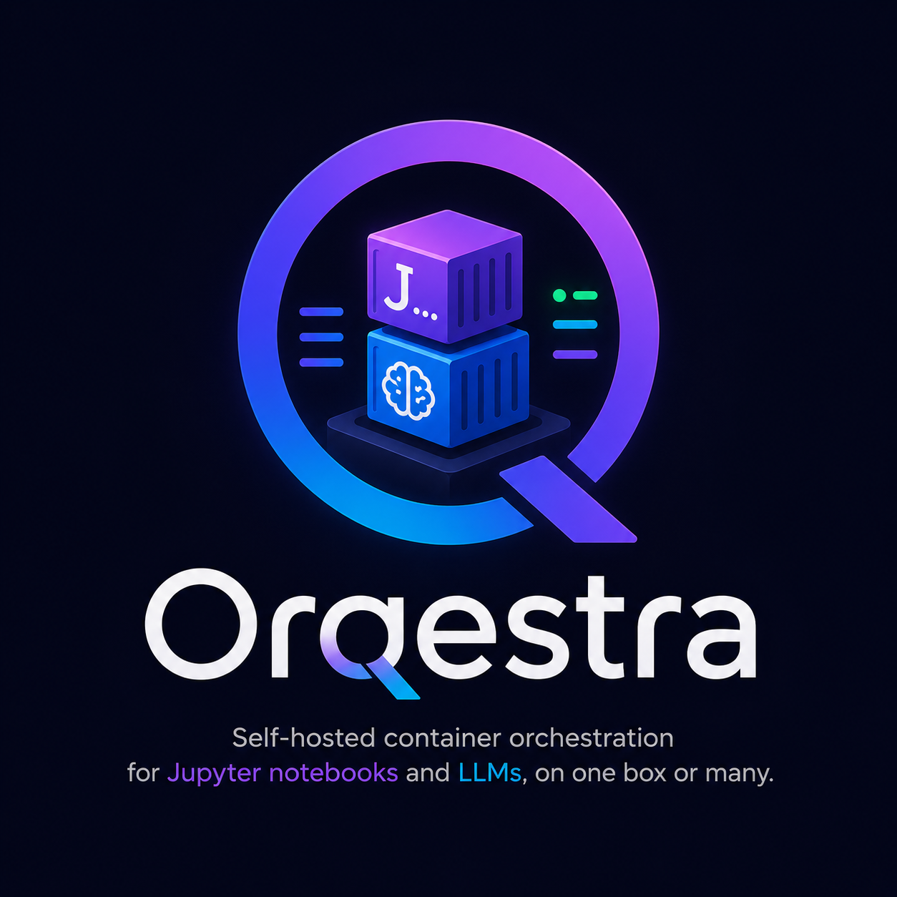

<p align="center">
  
</p>

# Orqestra

Self-hosted container orchestration for **Jupyter notebooks** and **LLMs**, on one box or many.

- Spin up isolated **Jupyter containers** (Base / TensorFlow / PyTorch / R) with persistent volumes, served at `https://<slug>.<domain>` with token auth.
- Host **LLMs** through Ollama or Docker Model Runner — search the live catalog, pick a model + tag, container exposes an OpenAI-compatible API at `/v1/chat/completions`.
- Live **container logs** + **resource stats** streamed to the dashboard via WebSockets.
- **File explorer** to browse + download files inside any Jupyter container.
- Full **TLS** via Traefik + Let's Encrypt + Cloudflare DNS-01.
- Multi-tenant with auth (Better Auth), tags, multi-select bulk delete.

---

## Install

One command — Linux or macOS, x64 or arm64:

```bash
curl -fsSL https://orqestra.xyz/install | bash
```

Picks per-arch binary, runs interactive installer.

Two install modes:

| Mode | Use when | What you get |
|------|----------|--------------|
| **local** | Laptop / dev box | Plain HTTP, ports on localhost, no domain |
| **server** | Public host | HTTPS via Traefik, wildcard DNS, full feature set |

Full walkthrough: **[docs/INSTALL.md](docs/INSTALL.md)**.

---

## Stack

| Layer | Tech |
|-------|------|
| Web | Next.js 15 (App Router), Tailwind v4, shadcn-style |
| API | Bun + Hono + tRPC v11 + Better Auth + BullMQ |
| WebSocket | Bun native WS — fans Redis pubsub to browser |
| Orchestrators | Go + Gin + Docker SDK (one for Jupyter, one for hosting/models) |
| Reverse proxy | Traefik v3 + Let's Encrypt (DNS-01 via Cloudflare) |
| Data | PostgreSQL 17 + Drizzle ORM, Redis 7 |
| Catalog | Live `docker model search` + Hub API + Ollama scrape |

---

## Architecture

```
                 browser
                    │
                    ▼
   ┌──────── Traefik (server mode) ────────┐
   │  *.{domain} → routes by Host header   │
   └─┬───────────────┬───────┬─────────────┘
     │               │       │
     ▼               ▼       ▼
   web (3000)    api (4000)  ws (4001)
                     │              │
                     │  ┌───────────┘
                     ▼  ▼
                  Postgres + Redis
                     │
                     ├─→ orchestrator-jupyter (8080) ─→ Docker socket
                     │      └─ creates jupyter/* containers, manages volumes
                     │
                     └─→ orchestrator-hosting (8081) ─→ Docker socket
                            ├─ creates ollama/ollama containers per model
                            ├─ talks to Docker Model Runner via /v1/...
                            └─ scrapes Hub + Ollama for live catalog
```

Container logs + build progress stream:
```
container stdout/stderr
  → orchestrator's logtail goroutine (docker logs -f)
  → Redis PUBLISH container-logs:<projectId>
  → ws server PSUBSCRIBE container-logs:*
  → browser WebSocket
```

---

## Repo layout

```
apps/
  api/                  Bun + Hono + tRPC + BullMQ workers
  ws/                   Bun WebSocket fan-out
  orchestrator-jupyter/ Go + Gin (Jupyter container manager)
  orchestrator-hosting/ Go + Gin (LLM hosting + catalog)
  web/                  Next.js 15 dashboard
packages/
  db/                   Drizzle schema + client
  trpc/                 Shared routers + types
  env/                  t3-env validated env schemas
  models/               Catalog refresh logic
docker/
  traefik/              Traefik config + acme.json
  jupyter-images/       Optional custom Jupyter images
scripts/
  install.sh            Full bash installer (no binaries; runs every step)
docs/                   Documentation
docker-compose.yml
turbo.json
pnpm-workspace.yaml
```

---

## Documentation

- **[docs/INSTALL.md](docs/INSTALL.md)** — End-user install walkthrough
- **[docs/DEVELOPMENT.md](docs/DEVELOPMENT.md)** — Clone the repo, run from source, contribute
- **[docs/RELEASING.md](docs/RELEASING.md)** — Maintainer: build binaries, tag, publish releases
- **[RUN_COMMANDS.md](RUN_COMMANDS.md)** — Quick reference for all dev commands
- **[BUILDER.md](BUILDER.md)** — Original spec (kept for reference)

---

## Status

v1.0.0 — single-server, single-org. Mature local-dev path; server install tested with Cloudflare DNS-01. SaaS multi-tenant is not yet supported (one user pool per install).

---

## Roadmap / future features

Tracking what's planned but not built. Order is rough priority, not a commitment.

- [ ] **AgentDock** — host a personal team of agents that work for the user. Each agent is its own container with its own runtime (local Ollama / Docker Model Runner, OpenAI, or Anthropic Claude) and its own persona/tools, but they all share a **single contextual workspace** — files, conversation history, scratchpad, and tool outputs are visible to every agent in the dock. Hand a task to one agent, another picks up the thread without re-priming. Backed by a shared vector store + event log so context propagation is automatic.
- [ ] **Static-site hosting** — clone repo, build, serve at `<slug>.<domain>` (was scaffolded in env, removed; will return when implemented end-to-end).
- [ ] **SaaS multi-tenant** — orgs, per-org quotas, billing hooks.
- [ ] **GPU scheduler** — fair-share across users + project priorities, instead of first-come.
- [ ] **Backups** — postgres + named-volume snapshot/restore CLI.
- [ ] **Audit log** — who started/stopped which container, exposed in dashboard.
- [ ] **Per-project secrets vault** — bound to container env at create time, encrypted at rest.

PRs and issue threads welcome — file under the relevant feature label.

---

## License

See [LICENSE](LICENSE).
